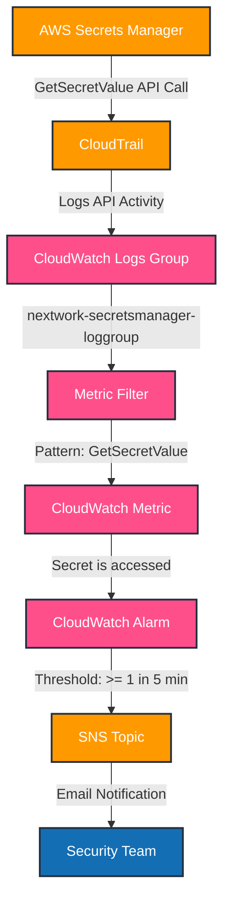
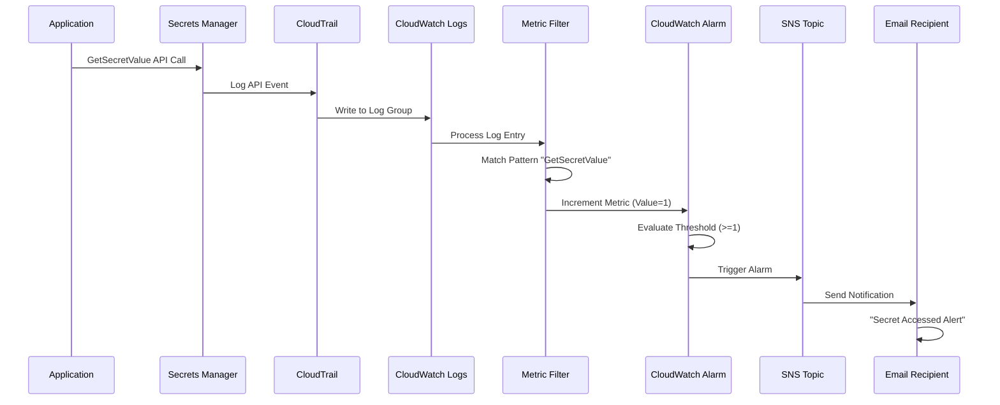

# 🔐 AWS Secrets Manager Monitoring System

[](https://aws.amazon.com/cloudtrail/)
[](https://aws.amazon.com/cloudwatch/)
[](https://aws.amazon.com/sns/)

> **Real-time monitoring and alerting system for AWS Secrets Manager access events**


This project implements a comprehensive monitoring solution that tracks and alerts on AWS Secrets Manager access patterns using CloudTrail, CloudWatch, and SNS. Get instant email notifications whenever your secrets are accessed!

---

## 📋 Table of Contents

- [Overview](#-overview)
- [Architecture](#-architecture)
- [Features](#-features)
- [Components](#-components)
- [Setup Guide](#-setup-guide)
- [How It Works](#-how-it-works)
- [Monitoring Flow](#-monitoring-flow)
- [Prerequisites](#-prerequisites)
- [Configuration Details](#-configuration-details)
- [Troubleshooting](#-troubleshooting)
- [Best Practices](#-best-practices)
- [Contributing](#-contributing)

---

## 🎯 Overview

This monitoring system provides real-time visibility into AWS Secrets Manager access patterns by creating an automated pipeline that captures API calls, processes them through metrics, and sends instant notifications when secrets are accessed.

### Why This Matters

- **Security Compliance**: Track who accesses your secrets and when
- **Audit Trail**: Maintain comprehensive logs of secret access events
- **Incident Response**: Get immediate alerts for unauthorized or unexpected access
- **Operational Visibility**: Understand secret usage patterns across your infrastructure

---

## 🏗️ Architecture



---

## ✨ Features

- ✅ **Real-time Monitoring**: Instant detection of secret access events
- ✅ **Automated Alerting**: Email notifications via Amazon SNS
- ✅ **Centralized Logging**: All CloudTrail logs in one dedicated log group
- ✅ **Custom Metrics**: Track secret access patterns over time
- ✅ **Configurable Thresholds**: Adjust alarm sensitivity based on your needs
- ✅ **Audit Ready**: Complete trail of all secret access attempts

---

## 🔧 Components

### 1. AWS CloudTrail
Monitors and logs all API activity related to AWS Secrets Manager, specifically capturing `GetSecretValue` events.

**Configuration:**
- Tracks Secrets Manager API calls
- Forwards logs to CloudWatch Logs
- Provides comprehensive audit trail

### 2. Amazon CloudWatch Logs
Centralizes all CloudTrail logs in a dedicated log group for easy management and analysis.

**Resources:**
- **Log Group**: `nextwork-secretsmanager-loggroup`
- **IAM Role**: Grants CloudTrail write permissions

### 3. CloudWatch Metric Filter
Scans incoming logs in real-time to detect secret access patterns.

**Configuration:**
- **Filter Name**: `GetSecretsValue`
- **Pattern**: `"GetSecretValue"`
- **Metric Namespace**: `SecurityMetrics`
- **Metric Name**: `Secret is accessed`
- **Metric Value**: `1` (when pattern matches)
- **Default Value**: `0` (when no match)

### 4. CloudWatch Alarm
Monitors the custom metric and triggers when thresholds are exceeded.

**Settings:**
- **Threshold**: Greater than or equal to 1
- **Evaluation Period**: 5 minutes
- **Action**: Triggers SNS notification

### 5. Amazon SNS
Delivers real-time email notifications to security teams.

**Setup:**
- SNS Topic created for alarm notifications
- Email subscription for instant alerts
- Scalable to multiple subscribers

---

## 📚 Setup Guide

### Prerequisites

Before you begin, ensure you have:

- AWS Account with appropriate permissions
- AWS CLI configured
- Access to AWS Console
- Email address for notifications
- IAM permissions for CloudTrail, CloudWatch, SNS, and Secrets Manager

### Installation Steps

#### Step 1: Configure CloudTrail

```bash
# Create a CloudTrail trail
aws cloudtrail create-trail \
  --name secretsmanager-monitoring-trail \
  --s3-bucket-name your-cloudtrail-bucket

# Start logging
aws cloudtrail start-logging \
  --name secretsmanager-monitoring-trail
```

#### Step 2: Create CloudWatch Log Group

```bash
# Create log group
aws logs create-log-group \
  --log-group-name nextwork-secretsmanager-loggroup

# Set retention policy (optional)
aws logs put-retention-policy \
  --log-group-name nextwork-secretsmanager-loggroup \
  --retention-in-days 30
```

#### Step 3: Configure IAM Role

Create an IAM role that allows CloudTrail to write to CloudWatch Logs:

```json
{
  "Version": "2012-10-17",
  "Statement": [
    {
      "Effect": "Allow",
      "Action": [
        "logs:CreateLogStream",
        "logs:PutLogEvents"
      ],
      "Resource": "arn:aws:logs:*:*:log-group:nextwork-secretsmanager-loggroup:*"
    }
  ]
}
```

#### Step 4: Create Metric Filter

```bash
aws logs put-metric-filter \
  --log-group-name nextwork-secretsmanager-loggroup \
  --filter-name GetSecretsValue \
  --filter-pattern "GetSecretValue" \
  --metric-transformations \
    metricName=Secret_is_accessed,\
    metricNamespace=SecurityMetrics,\
    metricValue=1,\
    defaultValue=0
```

#### Step 5: Create SNS Topic and Subscription

```bash
# Create SNS topic
aws sns create-topic --name secrets-access-alerts

# Subscribe email
aws sns subscribe \
  --topic-arn arn:aws:sns:region:account-id:secrets-access-alerts \
  --protocol email \
  --notification-endpoint your-email@example.com
```

**Important:** Confirm the email subscription by clicking the link in the confirmation email.

#### Step 6: Create CloudWatch Alarm

```bash
aws cloudwatch put-metric-alarm \
  --alarm-name secrets-manager-access-alarm \
  --alarm-description "Alert when secrets are accessed" \
  --metric-name Secret_is_accessed \
  --namespace SecurityMetrics \
  --statistic Sum \
  --period 300 \
  --evaluation-periods 1 \
  --threshold 1 \
  --comparison-operator GreaterThanOrEqualToThreshold \
  --alarm-actions arn:aws:sns:region:account-id:secrets-access-alerts
```

---

## 🔄 How It Works

### Monitoring Flow



### Event Flow Explained

1. **API Call**: Application calls `GetSecretValue` on AWS Secrets Manager
2. **CloudTrail Capture**: CloudTrail logs the API activity
3. **Log Delivery**: Logs are sent to the CloudWatch Log Group
4. **Pattern Matching**: Metric filter scans for "GetSecretValue" pattern
5. **Metric Update**: Custom metric is incremented to 1
6. **Alarm Evaluation**: CloudWatch evaluates if metric ≥ 1 within 5 minutes
7. **Notification**: SNS sends email alert to subscribed addresses

---

## 🔍 Configuration Details

### Metric Filter Pattern

The metric filter uses a simple text pattern match:

```
Pattern: "GetSecretValue"
```

This captures any log entry containing the GetSecretValue API call.

### Alarm Threshold

```yaml
Threshold: >=1
Period: 5 minutes
Evaluation Periods: 1
Statistic: Sum
```

The alarm triggers when at least one secret access occurs within a 5-minute window.

### Custom Metric

```yaml
Namespace: SecurityMetrics
Metric Name: Secret is accessed
Metric Value: 1 (on match)
Default Value: 0 (no match)
```

---

## 🐛 Troubleshooting

### Common Issues

**Problem**: Not receiving email notifications

**Solutions**:
- Verify email subscription is confirmed in SNS
- Check SNS topic permissions
- Ensure alarm is in ALARM state
- Review CloudWatch Logs for metric data

---

**Problem**: Metric not incrementing

**Solutions**:
- Verify CloudTrail is logging to CloudWatch Logs
- Check metric filter pattern syntax
- Ensure IAM role has correct permissions
- Review CloudTrail events in the log group

---

**Problem**: Alarm not triggering

**Solutions**:
- Verify alarm threshold configuration
- Check evaluation period settings
- Ensure metric has data points
- Review alarm history in CloudWatch console

---

## 🎯 Best Practices

1. **Regular Testing**: Periodically test the alerting pipeline by accessing secrets
2. **Log Retention**: Set appropriate retention periods for cost management
3. **Access Review**: Regularly review CloudWatch Logs for access patterns
4. **Alert Fatigue**: Adjust thresholds to reduce false positives
5. **Multiple Subscribers**: Add multiple email addresses or integrate with incident management tools
6. **Tagging**: Use consistent tagging for all resources for better organization
7. **Documentation**: Keep runbooks updated for incident response procedures

---

## 🔐 Security Considerations

- Ensure IAM roles follow the principle of least privilege
- Regularly audit CloudTrail logs for suspicious activity
- Enable MFA for critical AWS accounts
- Use SNS encryption for sensitive notifications
- Implement additional layers of security for production environments

---

## 📊 Monitoring Dashboard

Consider creating a CloudWatch Dashboard to visualize:

- Secret access frequency over time
- Alarm state history
- Top accessing IAM principals
- Geographic distribution of access requests

---

### Areas for Enhancement

- Integration with AWS Security Hub
- Slack/Teams notification support
- Advanced filtering based on IAM principals
- Automated remediation workflows
- Enhanced dashboards and visualizations

---

## 🙏 Acknowledgments

Built with AWS best practices for security monitoring and alerting.

---

<div align="center">

**[⬆ Back to Top](#-aws-secrets-manager-monitoring-system)**

Made with ❤️ for AWS Security

</div>
